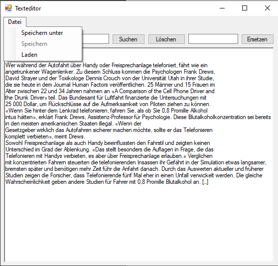
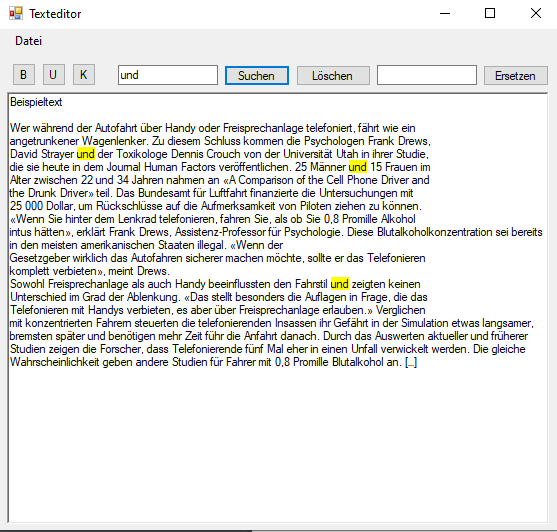
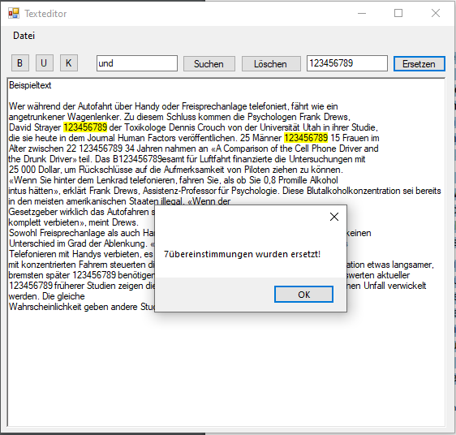

# Texteditor

**.NET-Framework-Texteditor** ist ein einfacher Texteditor der im .NET-Framework entwickelt wurde.

## Download

- 🟢 **[Neuster Release](https://github.com/derech1e/.NET-Framework-Texteditor/releases/latest)**

## Features

- Fetter Text
- Kursiver Text
- Unterstrichener Text
- Suchen im Text
- Ersetzen im Text
- Speichern mit einfacher versionierung

## Screenshots

